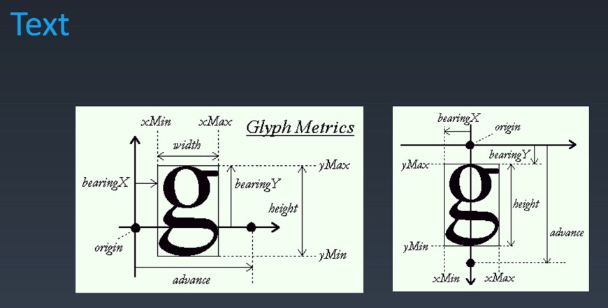

# 1. CSS排版 | 盒
| 源代码 | 语义 | 表现 |
| ---- | ----- | ---- |
| 标签 tag | 元素 element | 盒 box

- HTML代码可以书写开始`标签`,结束`标签`,和自封闭`标签`。
- 一对起止的`标签`，表示一个`元素`。
- DOM树中储存的是`元素`和其他类型的节点（Node）。
  - 节点说的是，存储在DOM上的也不一定是元素，比如文本节点，等。
- CSS选择器选中的是`元素`。
  - 也可以是伪元素。
- CSS选择器选中的`元素`，在排版时可能产生多个`盒`.
  - 可能是一对多的选择
- 排版和渲染的基本单位是`盒`。

## 盒模型

- padding主要影响盒内排版
- margin主要影响盒本身排版
- box-size:
   - content-box
     - 设置的width只包含content的内容，这个时候盒子占用的空间为content-box+padding+border+margin
  - border-box
    - 包含padding+border+content-box

# 2. CSS排版 | 正常流

## 三代排版技术

**`layout 排版` 可见的东西放到指定的位置**

**`css`就是将一切的盒 文字安排到指定的位置**

- 基于正常流排版
  - 能力最差
  - 机制复杂
- 基于flex技术排版（主流 也最简单）
  - 比前一代后一代都简单
- 基于grid技术排版
- 3.5 基于CSS Houdini 可以用JS干预的排版

### 基于正常流排版
- 收集`盒`进行
  - 盒与文字
- 计算盒在行中的排布
  - 盒与文字
- 计算行的排布

# 3. CSS排版 | 正常流的行级排布

- Baseline(基线)
  - 文字在书写时的基础参照线
- Text
  - C++底层库 freeType 参照原点（origin）对一个字母进行抽象定义

- 行模型
  - line-top
    - 如果行高大于文字的高度就表示行的最高的线
  - text-top
    - 字体混排时，一行中最大的字决定
  - base-line
  - text-bottom
    - 字体混排时，一行中最大的字决定
  - line-bottom
    - 如果行高大于文字的高度就表示行的最低的线

## line.html中表示的
行内盒 inline-block 基线是根据里边文字最后一行对齐的
添加vertical-align属性可以规定inline-block的对齐方式
- vertical-align
  - top
    - line-top
  - bottom
    - line-bottom
  - text-top
  - text-bottom