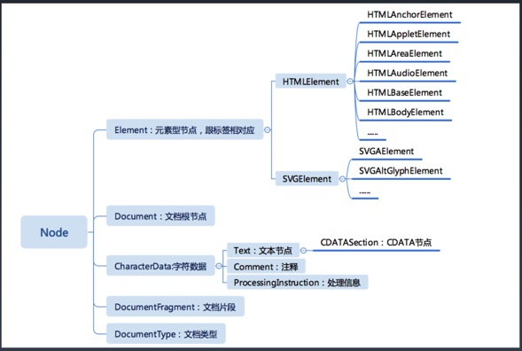

# 1. 重学HTML | HTML的定义：XML与SGML
- HTML的定义：继承与XML与SGML的基础
## DTD与XML namespace

- http://www.w3.org/TR/xhtml1/DTD/xhtml1-strict.dtd 
  - 使用css属性white-space代替`&nbsp;`,因为使用`&nbsp;`改变了原有的HTML语义结构
  - white-space 属性会影响到浏览器对文档中空格、回车和制表符的处理效果。
  - `&Lambda`就是`^`
- http://www.w3.org/1999/xhtml

## DTD 常用转义符
| 字符	| 十进制 | 转义字符 |
| ---- | ----- | ------ |
| " |	`&#34;` |	`&quot;` |
| &	| `&#38;`	| `&amp;` |
| <	| `&#60;`	| `&lt; `|
| >	| `&#62;`	| `&gt; `|
| 不断开空格(non-breaking space) | `&#160;` |	`&nbsp;` |
# 2. 重学HTML | HTML标签语义

- `<main></mian>` 放的主要部分 表示一个
- `<hgroup></hgroup>` 标题组
- `<abbr></abbr>` 表示缩写、简写 有title属性
- `<strong></strong>` 表示重点 文章的重点
- `<em></em>` 表示强调 语气上
- `<figure></figure>` 用作文档中插图的图像
- `<figcaption></figcaption>` 元素为 figure 添加标题
- `<nav></nav>` nav 标签定义导航链接的部分。
- `<dfn></dfn>` dfn表示定义当前的词
- `<samp></samp>` 表示例子
- `<pre></pre>` 表示引入代码
- `<code></code>` 代码

# 3. 重学HTML | HTML语法

## 合法元素
- Element: `<tagname>...</tagname> `
- Text: text
- Comment: `<!-- comments -->`
- DocumentType: `<!Doctype html>`
- ProcessingInstruction: `<?a 1?>`
- CDATA:`<![CDATA[ ]]>`

## 字符引用
- `&#161;`
  - 引用ASK编码&+数字
- `&amp; `
  - `&`符号
- `&lt;`
  - `<`
- `&quot;`
 - 引号`"`

# 4. 浏览器API | DOM API

## dom节点家族

## 导航类操作
- 选择节点有两种方式，按照node节点选择，按照元素节点选择
- 按照节点选择容易选到空节点，但是是按照元素不会

- 对于节点的操作
  - parentNode 
  - childNodes 
  - firstChild
  - lastChild
  - nextSibling
  - previousSibling
- 对于元素的操作
  - parentElement
  - children
  - firstElementChild
  - lastElementChild
  - nextElementSibling
  - previousElementSibling

## 修改操作

- appendChild
  - 插入到最后节点
- insetBefore
  - 插入到具体节点前
- removeChild
  - 无法移除自身，只能在父级上去操作
- replaceChild

## 高级操作
- compareDocumentPosition 是一个用于比较两个节点中关系的函数。
- contains 检查一个节点是否包含另一个节点的函数
- isEqualNode 检查两个节点是否完全相同。
- isSameNode 检查两个节点是否是同一个节点，实际上在JavaScript 中可以用“===”。
- cloneNode 复制一个节点，如果传入参数 true，则会连同子元素 做深拷贝。