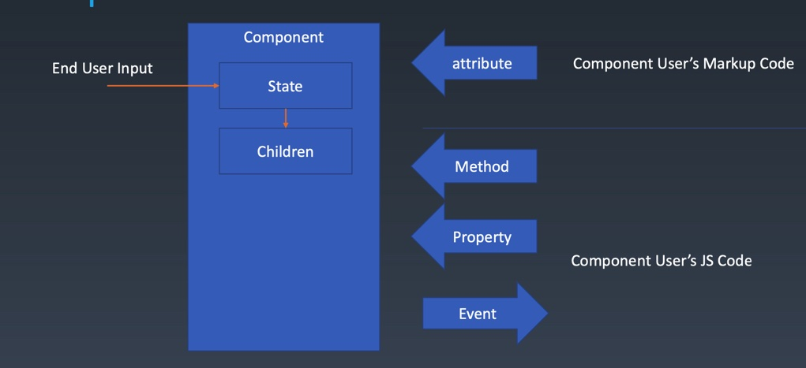

# 1. 组件的基本知识 | 组件的基本概念和基本组成部分

## 对象与组件
| 对象 | 组件 | 描述 |
| --- | ---- |-------|
| Properties | Properties|属性 |
| Methods | Methods | 方法  |
| Inherit | Inherit | 继承关系 |
| | Attribute | 特性|
| | Config & State | 组件配置 与 组件的状态 |
| | Event | 组件往外传东西 |
| | Lifecycle | 组件有生命周期 |
| | Children | 形成树形结构必备 |
## Component

- `End User Input` 改变 `Component State`
- `Component User’s ` 通过 `Markup Code (标记语言 xml html ...)` 改变 `attribute` 使用组件
- `Component User’s ` 通过 `JS Code` 改变 ` Method` `Property` 使用组件
- `Component Dever’s ` 通过 `JS Code` 设计 ` Method` `Property` 向 `Component User’s ` 设计组件
## Attribute 与 Property
- `Attribute` 强调描述性
- `Property` 强调从属关系

### HTML中的 Attribute 与 Property
- Attribute:
```html
<my-component attribute=“v” />
<script> 
myComponent.getAttribute(“a”);
myComponent.setAttribute(“a”,“value”);
</script>
```
- Property
```js
myComponent.a = “value”;
```
#### HTML中的 Attribute 与 Property 区别点
- html中class关键字不能使用，当前版本JS可以取到clss，但是html中还是不能使用
```html
<div class="cls1 cls2"></div>
<script>
var div = document.getElementByTagName(‘div’); 
div.className // cls1 cls2
div.class //当前版本 也是可以取到的
</script>
```
- html中 `Attribute` 可以写成`string`,但是`Property`转化为了KV结构的对象
```html
<div class="cls1 cls2" style="color:blue" ></div> 
<script>
var div = document.getElementByTagName('div'); 
div.style // 对象
</script>
```
- href属性获取到的`Attribute`就是里边的内容，但是`Property`会随着当前页面的协议改变
```html
<a href="//m.taobao.com" ></div>
<script>
var a = document.getElementByTagName('a’);
a.href // “http://m.taobao.com”，这个 URL 是 resolve 过的结果
a.getAttribute(‘href’) // “//m.taobao.com”，跟 HTML 代码中完全一致 
</script>
```
- 获取`value`属性节点时，`Attribute`属性一直是初始值，改变的话会改变`Property`值，并且值会以修改后的值为最终值
  - JQ库提供的val方法获取到的就是最终的值
```html
<input value = "cute" />
<script>
var input = document.getElementByTagName(‘input’); // 若 property 没有设置， 则结果是 attribute
input.value // cute
input.getAttribute(‘value’); // cute
input.value = ‘hello’; // 若 value 属性已经设置，则 attribute 不变，property 变化， 元素上实际的效果是 property 优先
input.value // hello
input.getAttribute(‘value’); // cute
</script>
```
## 如何设计组件状态
组件属性 | Markup set | JS set | JS Change | User Input Change |
| ---------- | ------ | --------- | ----------------- | ---- | 
|property| ❌| ✔️| ✔️| ❓| 
|attribute| ✔️| ✔️| ✔️| ❓| 
|state| ❌| ❌| ❌| ✔️| 
|config| ❌| ✔️| ❌| ❌| 

❌ 不可以设置
✔️ 可以设置
❓ 视情况而定
- `property`
  - 不能通过`Markup`(标记语言)修改;
  - 可以通过`JS`设置，修改
  - 大部分情况下不可以通过`User Input Change`修改，少部分(来自于业务逻辑的)可以修改
- `attribute`
  - 不能通过`Markup`(标记语言)修改;
  - 可以通过`JS`设置，修改
  - 大部分情况下不可以通过`User Input Change`修改，少部分(来自于业务逻辑的)可以修改
- `state`
  - 可以通过`User Input Change`修改
    - 但是`state`的变化来自于组件内部，不然会让`组件使用者`改变组件的状态
    - `用户`改变组件的状态来实现业务逻辑
- `config`
  - 是个一次性结果
  - 只有在组件构造时被传进来，是不可被修改的
  - 所以只能通过`JS set`来设置，作为一个全局属性
### `Lifecycle` 组件的生命周期
- `created(创建)` 与 `destroyed(销毁)` 是组件的必备生命周期
**中间过程**
- `Mount` 挂载
  - `Mount` 挂载组件
  - `Unmount` 卸载 可以回到创建状态（组件的`Mount`就是一个挂上去卸下来的状态改变）
- `JS change/set` 组件没生效之前的get与set
  - 触发 `render/update` 改变组件状态
- `User Input` 用户输入
  - 触发 `render/update` 改变组件状态

## `Children`属性
有两种
- `Content` 型 `Children` 
  - 有几个`Children`显示几个`Children`
    - 比较简单，有就是有，没有就是没有
```html
<my-button>{{title}}</my-button>
```
- `Template` 型 `Children`
  - 作为一个模板，不知道要显示多少个的时候，需要设置参数决定
  - react中也不是没有`Template`型，是通过函数来实现的
```html
<my-list>
<li>{{title}}</li>
</my-list>
```


