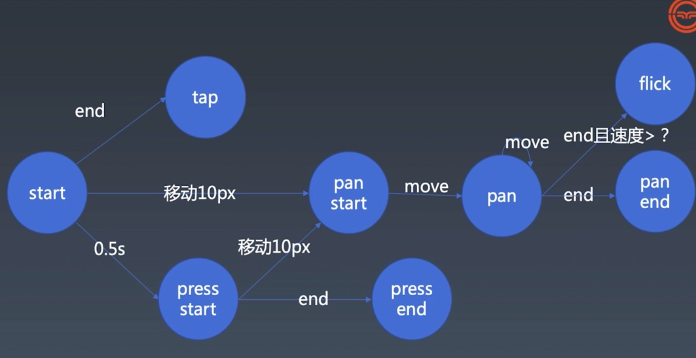

# 1. 手势与动画 | 初步建立动画和时间线
## 回顾
- clientX clientY
  - 浏览器可渲染区域的相对坐标，优点在于不受其他因素影响
- Math.sign(x)
  - 返回一个数的符号，得知一个数是正数、负数还是 0。
- Math.round(x)
  - 返回四舍五入后的整数。
- 负数取余
  - 取余运算 会将它所有的倍数约掉
  - 负数取余会是负数，在本例中负数取余应该往回算图片位置
```js
// (-1 +4)%4=3%4=3 
pos=(pos+children.length)%children.length;
```

# 2. 手势与动画 | 设计时间线的更新

- 添加 多个动画运行时，起始时间不一致的问题

# 3. 手势与动画 | 给动画添加暂停和重启功能
- 引入的一个问题，因为浏览器不能识别script的类型
```bash
Uncaught SyntaxError: Cannot use import statement outside a module
```
解决办法是设置引入的类型
```html
 <script type="module" src="./animation-demo.js"></script>
```

- 设置暂停和继续

# 4. 手势与动画 | 完善动画的其他功能
- 设置`timingFunction`和`template`的默认属性
- 设置重置
  - 虽然时间线上是重置了，但是动画上没有归到原位上
# 5. 手势与动画 | 对时间线进行状态管理
- 添加状态管理
# 6. 手势与动画 | 手势的基本知识
这只涉及单指事件
- start -> end 
  - 直接触发之后结束
  - 一次触发称为一次tap，类似于click事件
- start -> 移动10px -> pan start - move > pan -end> pan end
  - 一倍屏5px,3倍屏15px
  - pan 是一个摄影术语，表示一次移动摄像机
  - pan start 之后每一次move都会触发pan事件
  - end触发 pan end 事件
- start -> 移动10px -> pan start - move > pan -end且速度大于?> flick
  - 如果end的速度大于？某个值，则称为一个flick(扫过)
  - swipe 扫过一下 此处称为flick 
- start -0.5s按压>press start -move 10px>pan start
- start -0.5s按压>press start-end> press end
  - 按压屏幕
